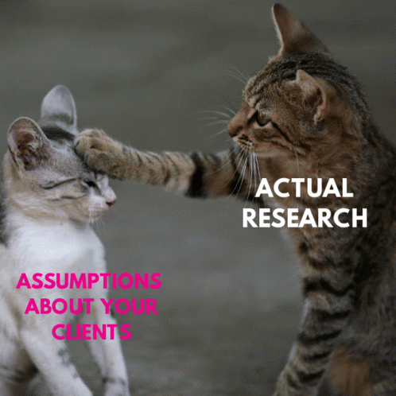
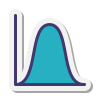

<h1 align="center">Привет, меня зовут <a href="https://t.me/aladina_da" target="_blank">Дарья!</a> 
</h1>

<h4 align="center"></h4>

<h3>🙋‍♀️Обо мне: </h3>

<ul dir="auto">
  <li>
    
Аналитик данных с математическим образованием и 2+ годами опыта в продуктовой команде
  на международных IT-проектах.
</li>
  
  <li>
 Получила степень бакалавра по специальности "Прикладная математика и информатика" в 2024 году (КубГУ, ФКТиПМ).
</li>
    
  <li>
Специализируюсь на поиске инсайтов в пользовательском поведении и автоматизации
  отчётности. Умею трансформировать данные в конкретные, измеримые решения для роста бизнеса и принятия правильных управленческих решений.
</li>
  
  <li>
В свободное время люблю изучать английский язык и играть с друзьями в настолки. Являюсь постоянным участником благотворительного английского клуба у себя в городе.
</li>
  
  <li>
Открыта для сотрудничества!🚀
</li>
</ul>

<h4>Контакты:</h4>

<a href="https://t.me/aladina_da" target="_blank"> Telegram</a> 

 dari.aladina@yandex.ru 

___
<h3>🛠️Стек: </h3>
<ul dir="auto">
<li> <code>Python</code>  
Jupyter Notebook, Google Colab, PyCharm 
Библиотеки: pandas, numpy, statsmodels, scipy, pingouin, prophet, seaborn, matplotlib, orbit, pandahouse  </li>
<li> <code>SQL</code>  
PostgreSQL, Redash, ClickHouse 
Написание сложных запросов, JOIN, агрегация данных, CTE, оконные функции  </li>
<li> <code>BI-системы</code>  
DataLens, Apache Superset,Tableau, Grafana </li>
<li> <code>Статистические методы</code>  
t, z, F, U, Хи2 тесты; бутстреп; A/A-сплитование, A/B-тесты; Дисперсионный, многофакторный, корреляционный, регрессионный, когортный анализы; RFM-сегментация; Прогнозирование временных рядов; Продуктовые метрики  </li>
<li> <code>Прочие</code>  
MS Office, Git, Airflow, Unit-economic, Postman </li>
</ul>
